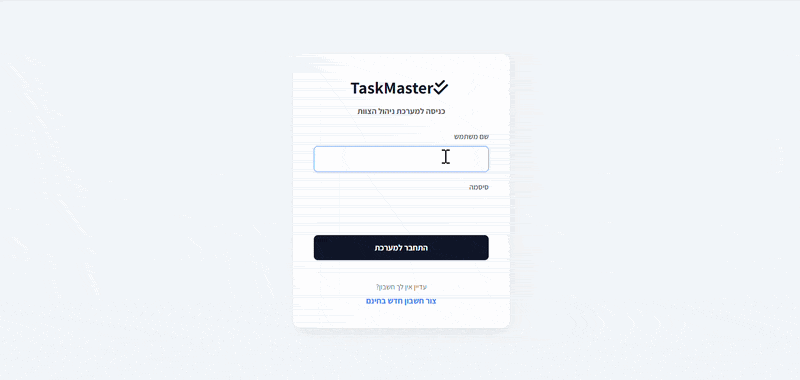
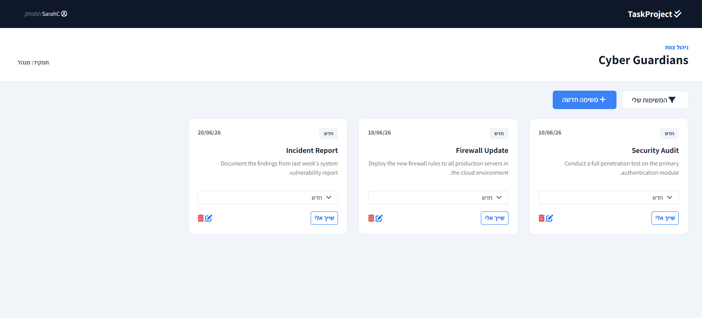
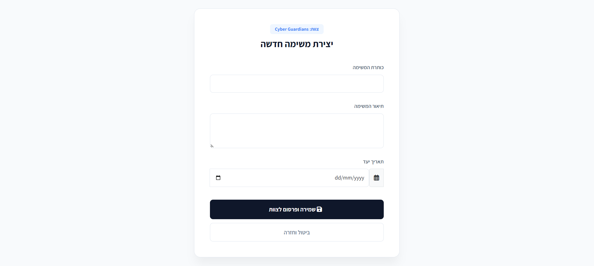

# Team Task Management System

A role-based task management platform built with Django and SQLite that enables teams to organize, assign, and track tasks efficiently through a secure and structured workflow.

## Key Features

* User authentication and authorization
* Team-based task isolation
* Manager and employee roles
* Task assignment workflow
* Status tracking (New → In Progress → Completed)
* Locked completed tasks
* Personal task filtering ("My Tasks")
* Secure server-side permission checks

## Technologies

* Python
* Django
* SQLite
* Bootstrap 5
* HTML / CSS
* Django Authentication System

## Business Logic

Managers can create, edit, and delete unassigned tasks, while employees can claim available tasks and update their progress. Tasks move through a defined workflow from **New** to **In Progress** and finally **Completed**. Once completed, tasks become locked to preserve data integrity.

Each team operates independently, ensuring that users can only access tasks associated with their own team, even if they attempt to manipulate URLs or requests manually.


## Project Demo

Here is the system in action:



### System Screenshots

**Dashboard View:**


**Task Management:**



## Getting Started

### Prerequisites

Make sure you have Python installed on your machine.

```bash
python --version
```

### Installation

```bash
git clone https://github.com/your-username/team-task-management-system.git
cd team-task-management-system
pip install -r requirements.txt
```

### Running the Application

```bash
python manage.py migrate
python manage.py runserver
```

Open your browser and navigate to:

```
http://127.0.0.1:8000
```
